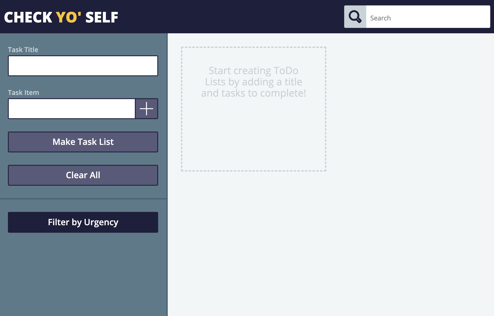

# Check YO' Self

by Amy Rippeto

## Objective

Check Yo' Self is a program for creating and modifying ToDo Lists. The user should be able to customize each list with a title and multiple task items. Once they have aded their list it should persist on the page upon reload. Some of the buttons should be disabled until the appropriate fields have been filled. There were additional features to incorporate that I was unable to complete within the timeframe of this project. 

## My Process

Before writing any code, I stared with a pen and paper to wireframe my HTML. Once I had all the required content I chose to use CSS Normalize. This was a first for me and I am glad I did, dispite the extra time it took me initially. I used percentages and em's where I could to make the page more responsive. This was very helpful once I added my media queries. 

The functionality is written in JavaScript. I used a separate file for my ToDoList Class for turning user's Task Lists into objects. The class was also used to JSON stringify these objects and save them to localStorage. This allowed me to access the data in my main JS file, parse, and reinstanciate into objects to recreated the user's lists upon reload. 

## Full Screen

## Media 

